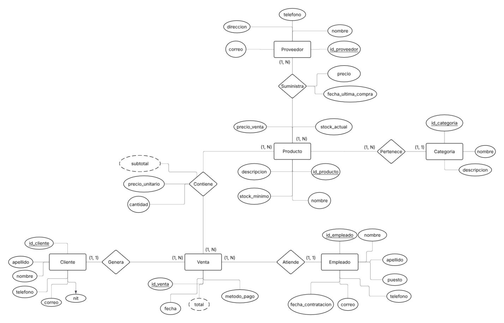

Proyecto 2 - Base de Datos 1
# Sistema de Ventas
**Proyecto 2 · Base de Datos 1** · Julián Divas (24687)

Sistema web para gestión de productos, clientes y ventas, construido con FastAPI, PostgreSQL y Nginx, completamente dockerizado.

---

# Diseño de la Base de Datos

Además, en el archivo Diseño DB.pdf se muestra el proceso de diseño y normalización de la base de datos


## Tecnologías

| Capa | Tecnología |
|---|---|
| Frontend | HTML, CSS, JavaScript vanilla |
| Backend | Python 3.11 · FastAPI · Uvicorn |
| Base de datos | PostgreSQL 15 |
| Servidor web | Nginx (Alpine) |
| Contenedores | Docker · Docker Compose |

---

## Estructura del proyecto

```
DB_proy2/
├── .env                        # Variables de entorno (DB credentials)
├── docker-compose.yml          # Orquestación de servicios
├── backend/
│   ├── main.py                 # Endpoints de la API (FastAPI)
│   ├── models.py               # Modelos Pydantic
│   ├── dbConnection.py         # Conexión a PostgreSQL
│   ├── requirements.txt        # Dependencias Python
│   ├── Dockerfile              # Imagen del backend
│   └── db/
│       └── init/
│           ├── 01_schema.sql   # DDL — creación de tablas
│           ├── 02_data.sql     # Datos iniciales
│           ├── 03_Index.sql    # Índices
│           └── 04_views.sql    # Vistas (vista_productos)
└── frontend/
    ├── nginx.conf              # Configuración Nginx + proxy al backend
    ├── style.css
    ├── js/
    │   └── app.js              # Cliente HTTP (fetch wrapper)
    ├── index.html              # Dashboard
    ├── products.html           # Listado de productos
    ├── newProduct.html         # Crear / editar producto
    ├── clients.html            # Listado de clientes
    ├── newClient.html          # Crear / editar cliente
    ├── sales.html              # Listado de ventas
    └── newSale.html            # Registrar venta
```

---

## Modelo de base de datos

El sistema maneja las siguientes entidades:

- **Cliente** — nombre, apellido, teléfono, correo, NIT
- **Empleado** — nombre, apellido, puesto, teléfono, correo, fecha de contratación
- **Categoría** — nombre, descripción
- **Proveedor** — nombre, correo, dirección, teléfono
- **Producto** — nombre, descripción, stock actual/mínimo, precio, categoría
- **Venta** — cliente, empleado, fecha, método de pago
- **Detalle_venta** — productos por venta con cantidad y precio
- **Suministra** — relación proveedor-producto con precio y fecha

### Vista principal

`vista_productos` une `Producto` con `Categoria` y agrega un campo calculado `estado_stock`:
- `Disponible` — cuando `stock_actual > stock_minimo`
- `Bajo` — cuando `stock_actual <= stock_minimo`

---

## API — Endpoints

### Productos
| Método | Ruta | Descripción |
|---|---|---|
| GET | `/products` | Listar todos los productos |
| GET | `/products/{id}` | Obtener un producto |
| POST | `/products` | Crear producto |
| PUT | `/products/{id}` | Editar producto |
| DELETE | `/products/{id}` | Eliminar producto |

### Clientes
| Método | Ruta | Descripción |
|---|---|---|
| GET | `/clients` | Listar todos los clientes |
| GET | `/clients/{id}` | Obtener un cliente |
| POST | `/clients` | Crear cliente |
| PUT | `/clients/{id}` | Editar cliente |
| DELETE | `/clients/{id}` | Eliminar cliente |

### Ventas
| Método | Ruta | Descripción |
|---|---|---|
| GET | `/sales` | Listar todas las ventas |
| GET | `/sales/{id}` | Obtener una venta con detalle |
| POST | `/sales` | Registrar venta |
| DELETE | `/sales/{id}` | Eliminar venta |

### Otros
| Método | Ruta | Descripción |
|---|---|---|
| GET | `/dashboard` | Métricas para el dashboard |
| GET | `/stats` | Estadísticas generales |

---

## Requisitos previos

- [Docker Desktop](https://www.docker.com/products/docker-desktop/) instalado y corriendo
- Puerto **3000** disponible (frontend)
- Puerto **8000** disponible (backend)
- Puerto **5433** disponible (base de datos)

---

## Cómo levantar el proyecto

### 1. Clonar o descomprimir el proyecto

```bash
cd DB_proy2
```

### 2. Verificar el archivo `.env.example`

El archivo `.env.example` ya viene configurado en la raíz del proyecto:

```env
DB_USER=your_db_user
DB_PASSWORD=your_db_password
DB_NAME=your_db_name
DB_PORT=5432
DB_HOST=database

POSTGRES_USER=your_db_user
POSTGRES_PASSWORD=your_db_password
POSTGRES_DB=your_db_name
```

Cambiar las credenciales por las de las instrucciones para probar el proyecto

### 3. Levantar los contenedores

```bash
docker compose up --build
```

La primera vez descarga las imágenes base y construye el backend. Las siguientes veces es más rápido.

### 4. Abrir el frontend

Una vez que los tres contenedores estén corriendo, abre en tu navegador:

```
http://localhost:3000
```

Verás el dashboard con las métricas del sistema.


## Arquitectura de red

El frontend se sirve desde Nginx en el puerto 3000. Las llamadas al backend **no van directamente a `localhost:8000`** — van a `/api/...` y Nginx las redirige internamente al contenedor `backend:8000`. Esto elimina el problema de CORS porque el navegador ve todo como el mismo origen.

```
Navegador → localhost:3000/api/products
                    ↓
              Nginx (frontend)
                    ↓ proxy_pass
              backend:8000/products
                    ↓
              FastAPI + PostgreSQL
```

---

## Notas

- La base de datos persiste en un volumen Docker llamado `database_data`. Al hacer `docker compose down` los datos **no se pierden**. Para resetear la BD completamente usa `docker compose down -v`.
- El backend espera a que la base de datos esté lista (`healthcheck`) antes de iniciar.

Enlace al repositorio: https://github.com/jdivass/DB_proy2.git

# Implementaciones
## Diseño de Base de Datos
|Implementación | Puntaje  |
|---|---|
| Diagrama ER correcto: entidades, atributos, relaciones y cardinalidades  | 8  |
| Modelo relacional documentado (esquema en notación relacional) | 7 |
| Normalización justificada hasta 3FN: dependencias funcionales y pasos aplicados | 10 |
| DDL completo con PRIMARY KEY, FOREIGN KEY y NOT NULL | 5 |
| Script de datos de prueba realistas con al menos 25 registros por tabla | 5 | 
| Índices definidos explícitamente (CREATE INDEX) en al menos 2 columnas justificadas | 5 | 

## SQL 
|Implementación | Puntaje  |
|---|---|
| 3 consultas con JOIN entre múltiples tablas, visibles en la UI  | 10  |
| 2 consultas con subquery (IN, EXISTS, subquery correlacionado o en FROM), visibles en la UI | 10 |
| Consultas con GROUP BY, HAVING y funciones de agregación, visibles en la UI | 8 |
| Al menos 1 consulta usando CTE (WITH), visible en la UI | 5 |
| Al menos 1 VIEW utilizado por el backend para alimentar la UI| 5 | 
| Al menos 1 transacción explícita con manejo de error y ROLLBACK | 12 | 

## Aplicación Web
|Implementación | Puntaje  |
|---|---|
| Manejo visible de errores para el usuario  | 5 |
| README con instrucciones funcionales y ejemplo de docker compose up | 5 |
| CRUD completo de al menos 2 entidades en la interfaz | 15 |
| | |

|**Total estimado**: | 115 |
|---|---|
 